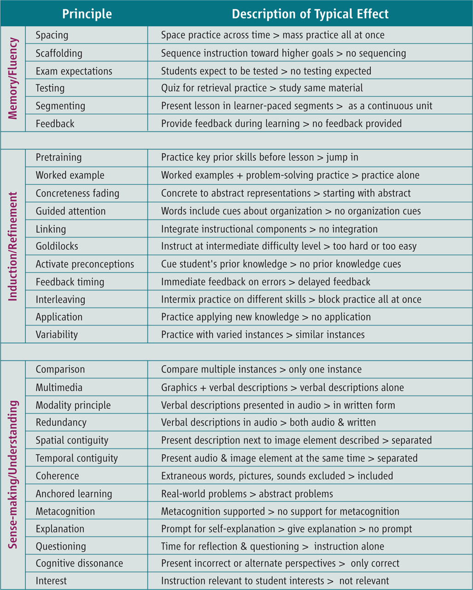

#notesFromPaper
Year   :
Tags   :
Authors: [[Koedinger]] [[Booth]] [[Klahr]]

Points out that researching instructional design is tough, and has some recommendations for how to better do that.

Table of Instructional Design Principles and good methods to tackle them.

[Further reading on each principle can be found in the supplementary material, specifically the xlsx file.](https://www.science.org/doi/10.1126/science.1238056)

