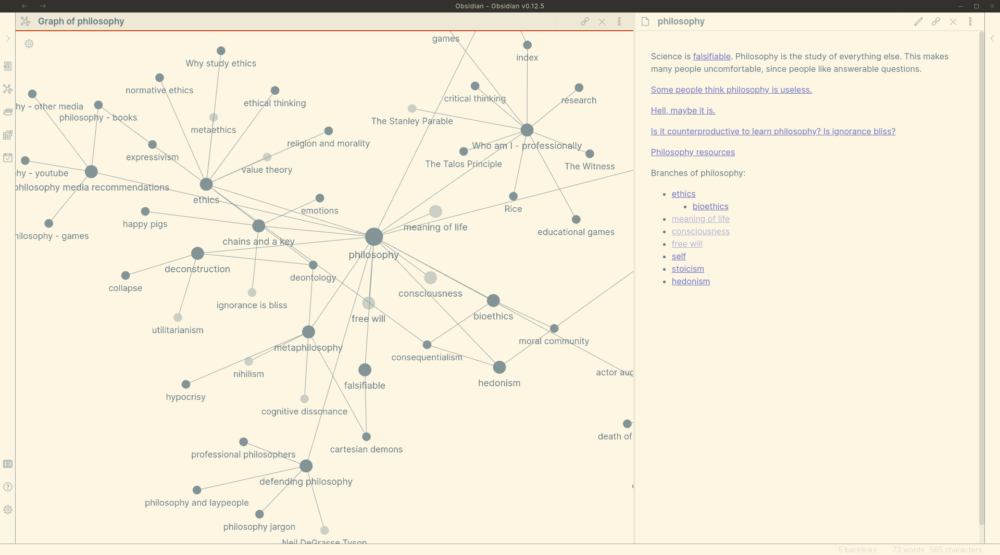

In the past I would write notes based on "what did the professor say today", and though I tried to maintain monolithic notes on certain topics, it got really annoying and I often wouldn't reread notes or maintain them.

Obsidian lets you link notes and jump between them. This means that I organize based on topic and can move between related topics easily. This is how the brain works, and just feels so much nicer.

In addition to letting you jump around, Obsidian also creates a visual graph that shows you your various linkages and lets you literally see the map of a topic. You can see how "computer science" is linked to "programming languages" is linked to "python"

**I know this is an extreme statement, and I don't say it lightly: Obsidian literally changed my life.** I've started writing notes for fun, and love seeing my graph grow; it's a visual representation of myself learning and growing. I reread my old notes instead of them being lost in the void of my directory structure

