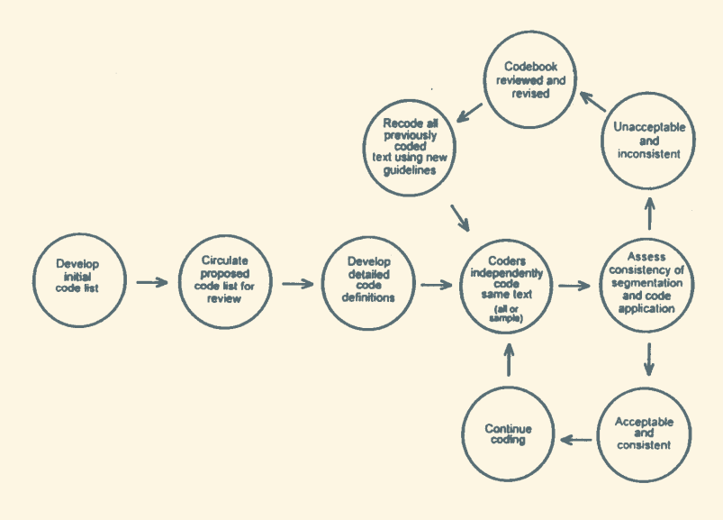

#notesFromPaper
Year   :
Tags   :
Authors: [[Macqueen]] [[Mclellan]] [[Kay]] [[Milstein]]

[[qualitative analysis]] involves systematic coding of text

Carey et. al 1996 for [[inter-rater reliability]]?

codebook has 6 basic components

 - code
 - brief definition
 - full definition
 - when to use
 - when not to use
 - examples

Page 33 describes a "coding matrix" connecting the responses to potential codes. Then you can collapse the codebook through data transformations on the matrix??

One or two people develop code list, review with whole team, definitions are proposed and reviewed whole team, then two or more coders code the same text to check validity (put these checks in every so often)

check validity by just direct diff check, or through kappa measurements (see [[inter-rater reliability]])

### Practical suggestions

 - *One* person should maintain the codebook
 - Regular meetings to make sure the natural evolution of the codebook is still in check
 - Limit to 30-40 codes w/ sets of codes that can be applied simultaneously before moving onto the next set
 - Develop a plan for segmenting text
 - Pre-establish validity metrics and tolerances (e.g. kappa must be > 0.8)
 - Be explicit in codes, don't make assumptions
 - Throw out codes that don't work
   - And codes that are really only for a single response.
   - Maybe make a UNIQUE catchall code for all these single responses
 - Recode as the codebook evolves
