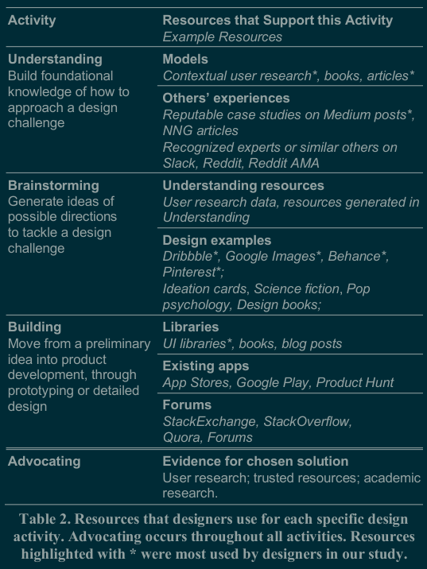

#notesFromPaper
Year   :
Tags   : [[solutions to academia industry divide]] #reflectiveFrameworkValidation
Authors: [[Colusso]] [[Bennett]] [[Hsich]] [[Munson]]

 - barriers to using academic resources
   - complex writing style
   - bad format
   - overlap between effective HCI and deceptive design
   - no focus towards pragmatic details
   - hard to find relevant papers
   - paywalls
 - cards are effective

 

A lotta good elaboration on this chart in the paper.

Regarding #reflectiveFrameworkValidation:

Has a lot of great stuff when we're actually designing our card deck... Their methods aren't significantly more complex than "we interviewed them and prompted them with existing design resources".
