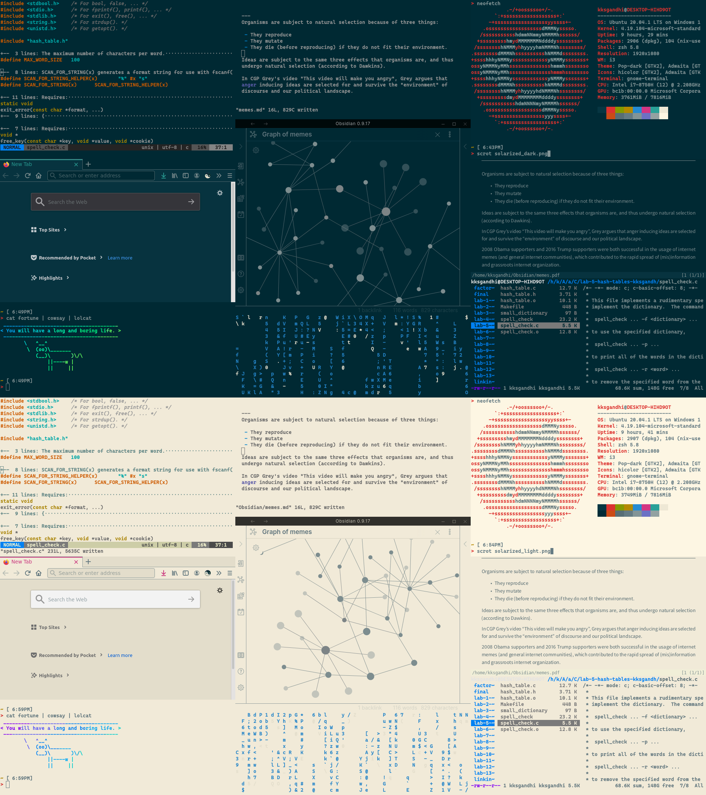
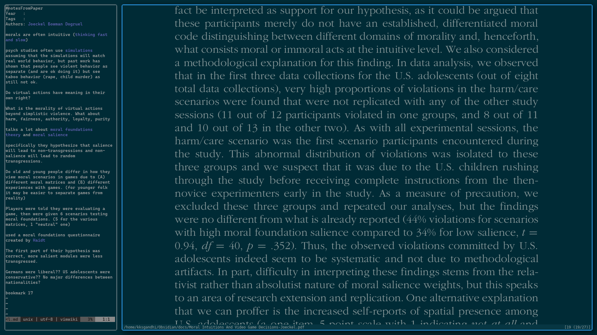

You stare at your computer all day, it's good to have a consistent colorscheme. Mixing colorschemes sucks because a single window that's bright surrounded by a bunch of windows that are dark causes a lot of eye strain

I really, really, really like the [solarized](https://ethanschoonover.com/solarized/) colorscheme, I've themed my  entire computer around it and have a hotkey to switch between light and dark.

Darkreader is a good browser extension.

Like look at how sexy this is:

