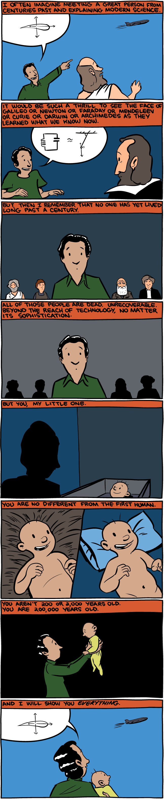

In High School, I sat through lectures and then went home and played games, and I learned from both. The way I learned from [[The Talos Principle]] was very different than how I learned from chemistry lectures, and this got me obsessed with [[informal learning]]

[[idealized class structure|Are lectures still useful in this modern age? How I would set up a class if I were forced to.]]

[[educational technology]]

[[educational theories]]

source: SMBC-Comics
