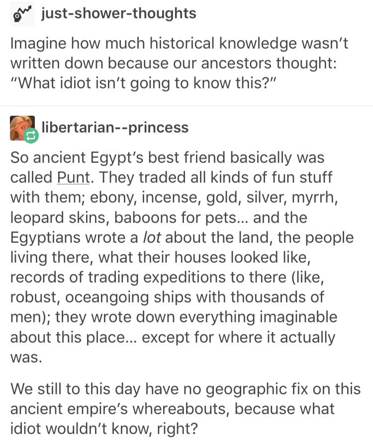

If a recipe calls for "eggs", we immediately assume "chicken eggs" because of shared cultural assumptions. In a thousand years, if that knowledge is lost, then future historians would have no idea how our recipes worked. What has been lost to history because of shared and lost culture?

