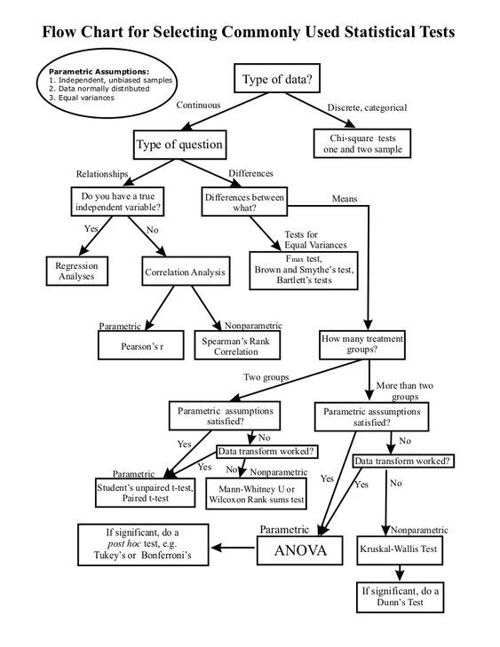

 - [[chi square test]]
 - [[t test]]
 - [[Kruskal-Wallis test]]
 - [[Mann Whitney test]] or alternatively the [[KS test]]
 - [[Friedman test]]
 - [[aligned rank transform]]
 - [[Shapiro Wilk]] for test of normality
 - [[TOST]] for *equivalence* of means instead of difference
 - Cohen's Kappa for Inter-rater reliability
 - [Multiple Linear Regression](https://www.scribbr.com/statistics/multiple-linear-regression/)

Why are there so many [[ANOVA]]s

[[test validity]]
