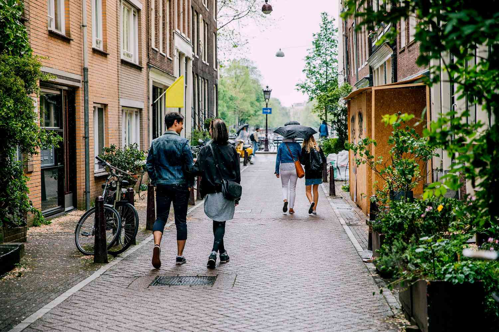

You should be in favor of public transit and bicycle lanes, **even if you never use them!**

Public transit and bike lanes:

 - Save you money in taxes (They're much cheaper to build than a road for cars, so everyone else who uses them spend less of your taxes)
 - Decrease traffic and increase parking availability (A good system can move more people than you can with cars. Anyone who uses public transit isn't in your way when you're driving, isn't taking up a parking spot when you're parking.)
 - Create connected, healthy communities (It's easy to walk around your community when you don't have to cross a 6 lane road and a massive parking lot. Communities where people walk around and go outside become stronger and better connected.)
 
People tend not to bike / use public transit in the U.S. because they're such crap, but _every single city_ that has a coherent system has seen these benefits. _Every single city_ regardless of temperature, elevation, anything.

